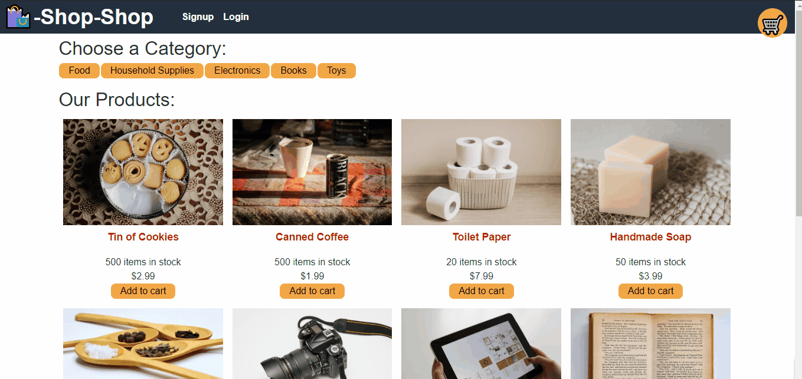

# State-Redux

## Table of Contents
* [Description](#description)
* [Installation](#installation)
* [Gif](#Gif)
* [links](#links)

### Description
refactor the e-commerce platform from Activity 26Links to an external site. so that it uses ReduxLinks to an external site. I made sweeping changes to the code, after i read through the Redux documentation on my own to find the information i need.

### Installation
* React
* React-dom
* Heroku
* MongoDB Atlas
* Node.js
* React- Router-Dom
* NPM Packages
* NPM Stripe package
* React-router-dom
* GraphQl

### Gif

### links
# github
# https://github.com/siddz415/State-Redux

# Heroku
# https://redux-state.herokuapp.com/